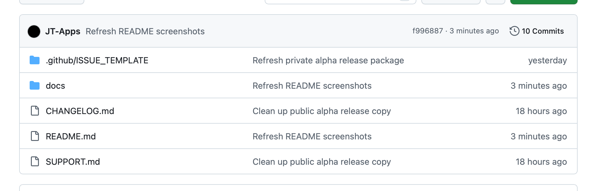
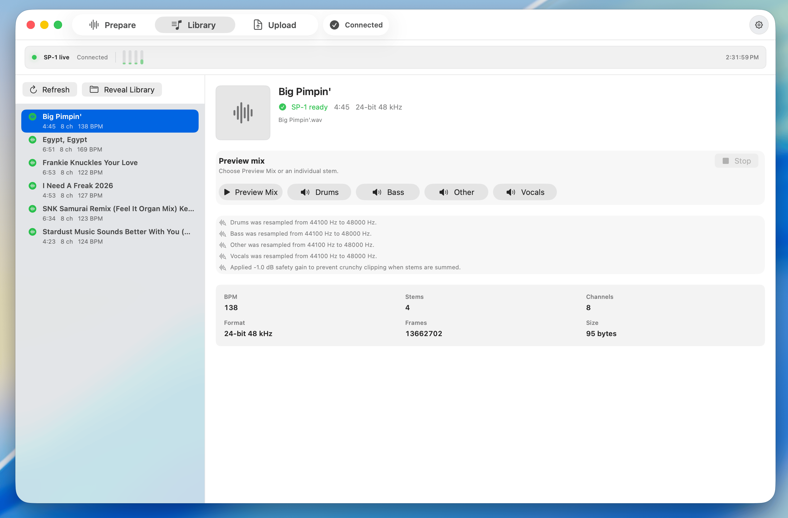
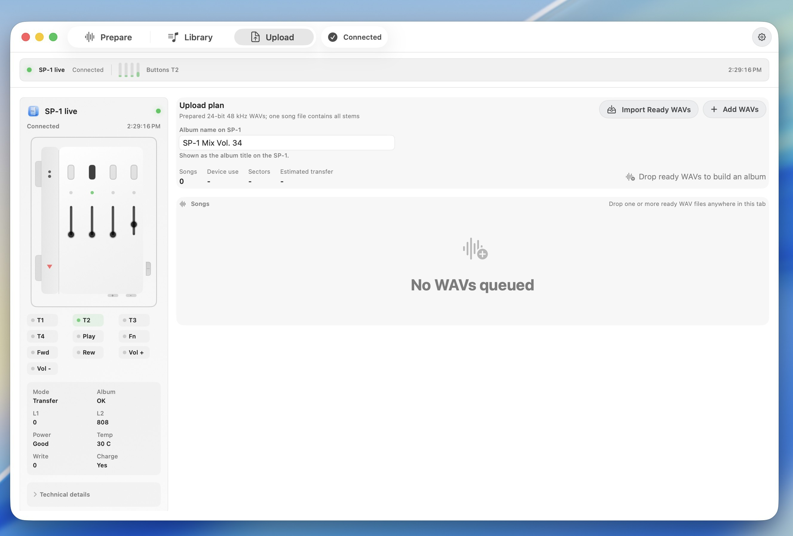

# SP-1 Utility

[Download the Mac DMG](https://github.com/JT-Apps/SP-1-Utility/releases)

**SP-1 Utility** is a native Mac app from [JT Apps](https://jtapps.xyz) for
preparing stem albums and transferring them to a Teenage Engineering SP-1 device over USB-C.

It is built for people who want the SP-1 workflow without Terminal, Homebrew,
Python setup, or coding tools. The app bundles the local processing engine, so
normal use is just download, install, prepare, preview, and transfer.

## What It Does

- Prepares regular songs or existing four-stem folders.
- Creates SP-1-ready WAVs: 24-bit, 48 kHz, eight-channel PCM.
- Keeps prepared tracks organized in a Library view.
- Plays master and individual stem previews inside the app.
- Transfers ready albums to the SP-1 over USB-C.
- Shows connection state, transfer status, confirmed progress, and recovery details.

## Download

The app download is in [Releases](https://github.com/JT-Apps/SP-1-Utility/releases).

Download `SP-1 Utility.dmg`, open it, drag **SP-1 Utility** into
**Applications**, then launch it from Applications.

The DMG is attached to the release instead of the Code tab because it is too
large for normal GitHub repository files.

## Three Simple Functions

### Prepare

Add songs or four-stem folders, set BPM, and create SP-1-ready output.

### Library

Review prepared tracks, play the preview mix, and check individual stems.

### Upload

Build an album plan, watch SP-1 live controls, and transfer ready WAVs over USB-C.

## Notes

- Keep the SP-1 plugged in and leave the Mac awake during transfer.
- Large transfers can take hours.
- A song is marked Done only after the SP-1 confirms the write sectors.
- Finder and Quick Look may not play upload WAVs normally because they are
  eight-channel device files. Use the app's Library preview for normal listening.

## Feedback And Bugs

Use the repository **Issues** tab to report bugs or feedback.

Helpful reports include:

- macOS version.
- SP-1 Utility version or release date.
- What you were doing: Prepare, Library, or Upload.
- Song title and row status, if a song was involved.
- A screenshot of the transfer panel, if upload was involved.

Please do not attach copyrighted audio files unless they are necessary and you
have permission to share them.

## Credits

SP-1 Utility includes compatibility research and workflow attribution to
[Solderless](https://solderless.engineering/) and the public
[SP-1 development wiki](https://github.com/timknapen/SP-1-dev/wiki).
