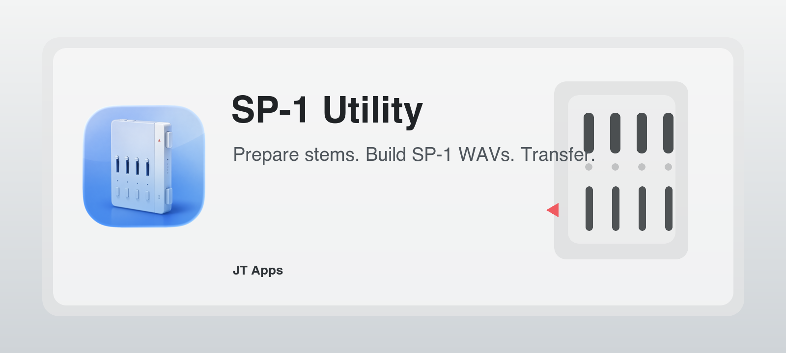

  

# SP-1 Utility

**SP-1 Utility** is a native macOS app by [JT Apps](https://jtapps.xyz) for
preparing stem albums and transferring them to an SP-1 over USB-C.

It is built for the practical SP-1 workflow: bring in songs, create
upload-ready 24-bit 48 kHz eight-channel WAVs, preview the results, then send a
full album plan to the device with clear progress and recovery status.

> Alpha note: this project is still in hands-on hardware testing. Long transfers
> can take hours, and tester reports are most useful when they include the app's
> transfer status, the song title, and whether the row ended as Done or Needs
> resend.

## Highlights

- Prepare songs or existing four-stem folders.
- Build SP-1-ready WAVs: 24-bit, 48 kHz, eight-channel PCM.
- Keep clean display names while using collision-safe prepared filenames.
- Browse prepared tracks in Library with master and stem previews.
- Transfer albums over USB-C with confirmed-sector progress and retry recovery.
- Monitor SP-1 faders, buttons, mode, power, and album status while connected.

## App Flow

| Step | What happens |
| --- | --- |
| Prepare | Add songs or stem folders, set BPM, and create SP-1-ready output. |
| Library | Review prepared tracks, play previews, and inspect diagnostics. |
| Upload | Build the album plan, confirm device use, and transfer ready songs. |

## Output Folders

Prepared files are written under the export folder selected in the app.

| Folder | Purpose |
| --- | --- |
| `Upload Ready WAVs` | The real full SP-1 WAVs used for upload. |
| `Library` | Per-song folders for source files, stems, previews, and manifests. |
| `SP-1 Ready` | Per-song shortcuts back to the full upload WAV. |
| `Stems` | Review/edit stems created during preparation. |
| `Source` | The original imported source for the prepared song. |

Finder and Quick Look are not reliable previews for eight-channel SP-1 WAVs.
Use the Library preview controls for normal stereo listening.

## Hardware Transfer Notes

- Keep the SP-1 plugged in and leave the Mac awake during transfer.
- A song is marked Done only after the SP-1 confirms the write sectors.
- If the device stops confirming writes, the app records the stop reason and
  resumes from the last confirmed sector when it can.
- Editing a completed row marks it for resend because the device copy no longer
  matches the local album plan.

## Download

The alpha is distributed as a Mac DMG. Open the DMG, drag **SP-1 Utility** into
**Applications**, and launch it like a normal Mac app.

No terminal, Homebrew, Python setup, or coding tools are required for normal
use. The local processing engine is bundled with the app.

See [docs/GITHUB_RELEASE_DRAFT.md](docs/GITHUB_RELEASE_DRAFT.md) for the public
release description and [docs/ALPHA_TESTING.md](docs/ALPHA_TESTING.md) for the
tester checklist.

## Credits

SP-1 Utility is developed by [JT Apps](https://jtapps.xyz).
