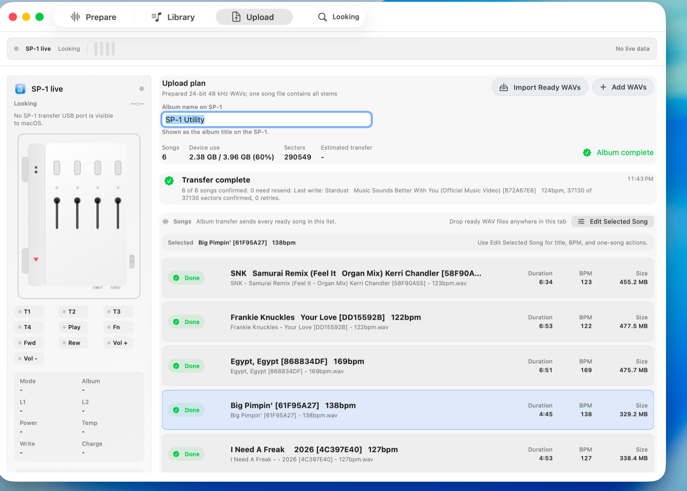
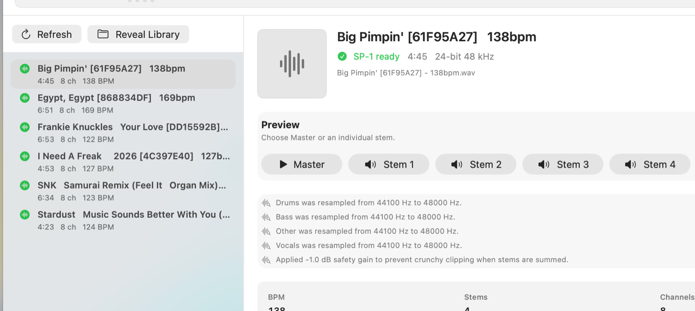

  

# SP-1 Utility

**SP-1 Utility** is a native Mac app from [JT Apps](https://jtapps.xyz) for
preparing stem albums and transferring them to an SP-1 over USB-C.

Built for the practical SP-1 workflow: add songs, create upload-ready
24-bit 48 kHz eight-channel WAVs, preview the results, and send an album plan to
the device with transfer status you can actually read.

## Highlights

- Prepare songs or existing four-stem folders.
- Build SP-1-ready WAVs: 24-bit, 48 kHz, eight-channel PCM.
- Keep clean display names while using collision-safe prepared filenames.
- Browse prepared tracks in Library with master and stem previews.
- Transfer albums over USB-C with confirmed-sector progress and retry recovery.
- Monitor SP-1 faders, buttons, mode, power, and album status while connected.

## Screenshots

### Upload

### Library

## Download

Open the latest release and download `SP-1 Utility.dmg`.

Install it like a normal Mac app: open the DMG, drag **SP-1 Utility** into
**Applications**, then launch it from Applications.

No terminal, Homebrew, Python setup, or coding tools are required for normal
use. The local processing engine is bundled with the app.

## Three Screens

| Area | What it does |
| --- | --- |
| Prepare | Add songs or four-stem folders, set BPM, and create SP-1-ready output. |
| Library | Review prepared tracks, play master and stem previews, and inspect diagnostics. |
| Upload | Build the album plan, confirm device use, and transfer ready songs. |

## Output Folders

Prepared files are written under the export folder selected in the app:

| Folder | Purpose |
| --- | --- |
| `Upload Ready WAVs` | The real full SP-1 WAVs used for upload. |
| `Library` | Per-song folders for source files, stems, previews, and manifests. |
| `SP-1 Ready` | Per-song shortcuts back to the full upload WAV. |
| `Stems` | Review/edit stems created during preparation. |
| `Source` | The original imported source for the prepared song. |

Finder and Quick Look are not reliable previews for eight-channel SP-1 WAVs.
Use the Library preview controls for normal stereo listening.

## Hardware Transfer Notes

- Keep the SP-1 plugged in and leave the Mac awake during transfer.
- A song is marked Done only after the SP-1 confirms the write sectors.
- If the device stops confirming writes, the app records the stop reason and
  resumes from the last confirmed sector when it can.
- Editing a completed row marks it for resend because the device copy no longer
  matches the local album plan.

## Alpha Testing

See [Alpha Testing](docs/ALPHA_TESTING.md) for the test checklist and issue
reporting format.

## Credits

SP-1 Utility includes compatibility research and workflow attribution to
[Solderless](https://solderless.engineering/) and the public
[SP-1 development wiki](https://github.com/timknapen/SP-1-dev/wiki).
